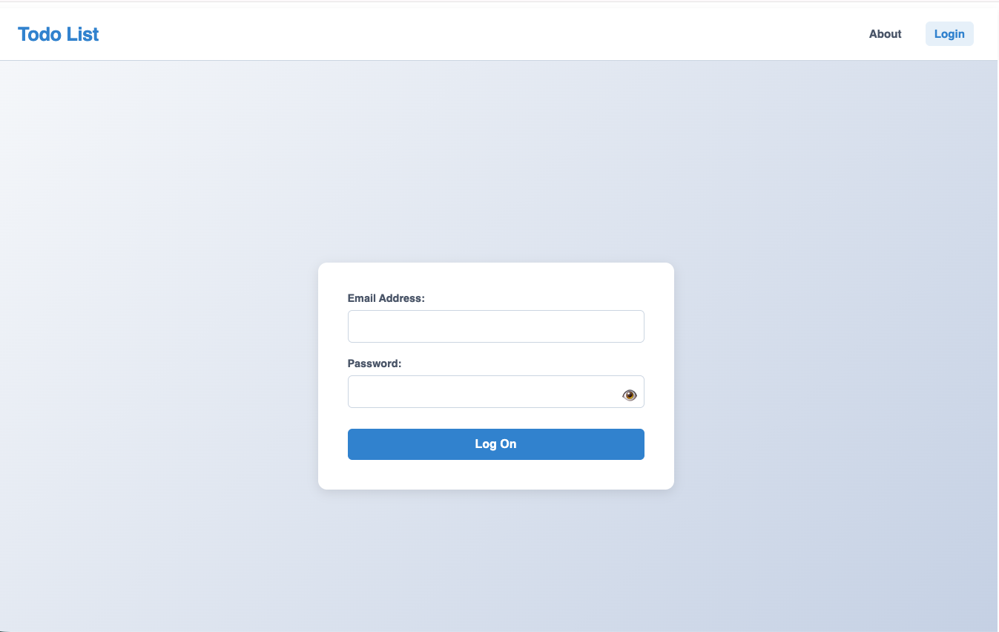
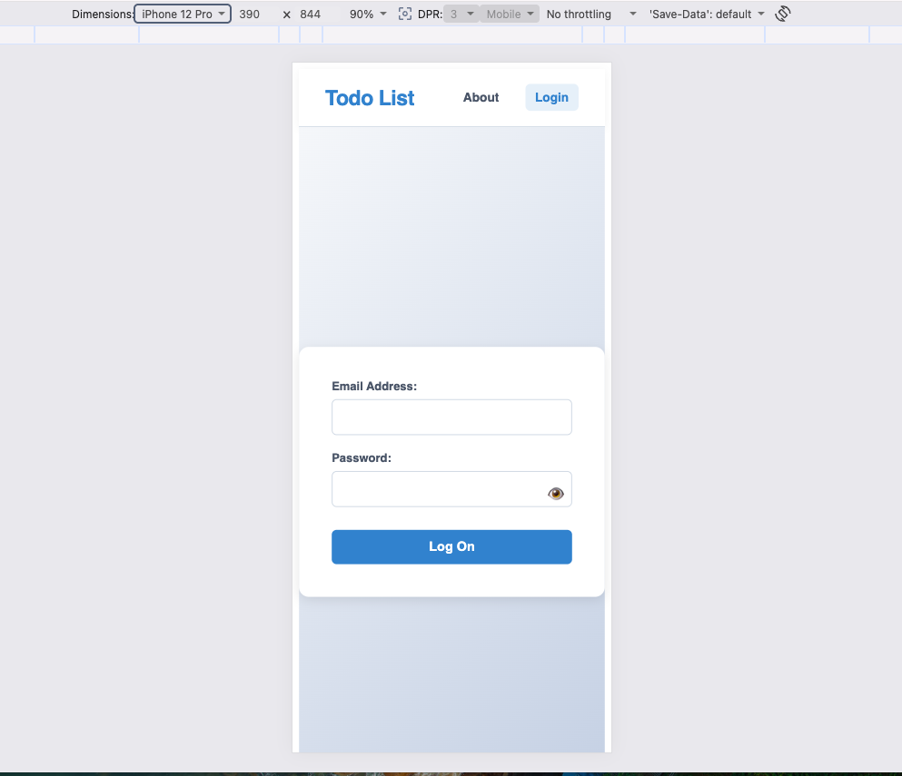

# Secure React Todo Application
A professional, React CRUD application built as part of the 2026 Code the Dream React Course curriculum.

## Live Demo
**Deployed Application:** [View Live Demo]() **Note:** I will not deploy at this moment. 

## Description
This application features user authentication, real-time analytics, and client-side security mitigation.

## Key Features
1. **User Authentication:** Protected routes with client-side history guards.
2. **Full CRUD Functionality:** Seamlessly add new items, edit titles inline, toggle completion statuses, and delete tasks instantly.
3. **Optimistic UI Updates:** Updates the user template immediately on action dispatch, featuring automatic state rollback protection if a network request fails.
4. **Advanced Search & Sorting:** Real-Time client-side search query input filtering paired with dual-dierection sorting(by date, ascending, descending, pending, done, and task title).
5. **Input Sanitation:** Form submissions enforce strict validation boundaries *before* scrubbing text through a `DOMPurify` shield to completely eliminate XSS vulnerabilities.
6. **Character Constraints:** Natively restricts input fields (`maxLength="100"`) to guarantee layout and database text overflow protection.
7. **Responsive Layout:** Modular CSS architecture matching standard desktop and fluid mobile screen frames. 

## Technology Used
1. **Core Framework:** React 18+ (Vite)
2. **Routing:** React Router
3. **State Management:** React Hooks (`useReducer`,`useContext`,`useMemo`,`useRef`,`useState`)
4. **Security & Sanitation:** DOMPurify, CSRF Tokens
5. **Styling Architecture:** CSS Modules

## Screenshots

### Desktop View:

### Mobile View:

## Getting Started
### Prerequisites
Make sure you have the following software environments installed locally.
1.**Node.js**(v18.x or higher recommended)
2.**npm** (v9.x or higher)

### Instalation Instructions
To get your copy of this project:

1. Clone the repo locally using [https://github.com/ACastilleja/Todo-List.git](https://github.com/ACastilleja/Todo-List.git).

2. Once inside your terminal navigate to the local repo's directory.

3. Install dependencies by running `npm install`.

4. Once dependencies are installed run `npm run dev` to start development server. 

5. Navigate to your URL provided by the terminal. 

## Available Scripts
In the project directory, you can run the follwing scripts using your terminal:
1. `npm run dev`: Starts the local development server using Vite with Hot Module Replacement(HMR).
2. `npm run build`: Compiles and bundles the application into highly optimized production-ready static files inside the dist/ folder.
3. `npm run preview`: Bootstraps a local web server to preview your production build locally before deploying it live.
4. `npm run lint`: Runs ESLint check scans across code patterns to discover and fix syntax or style inconsistencies. 

## Design Decisions
1. **Encapsulated CSS Modules:** Chosen to prevent global style bleeding across elements. 
2. **Optimistic Performance UX:** Rather than display blocking loading spinners for every creation or removal action, the UI predicts a successful server message to keep interactions fast and instantaneous.
3. **Responsive Fluid Grid:** Styled using a combination of CSS Flexbox and media boundaries to guarantee that text elements, task cards, and dashboard controls centers transition gracefully between compact mobile screens and desktop screens. 

## Future Improvements
1. **Drag and Drop:** Add drag and drop capability to move task around by simply draging them and dropping them according to importance. 
2. **Due Dates & Push Notifications:** Integrating local storage browser alarms or email notifications as deadlines approach. 
3. **Category Tags:** Color-coded label categorizations with specialized quick-filter buttons. 

## License Information
This project is licensed under the MIT License -see the [MIT Open Source Initiative](https://opensource.org/license/MIT)file for details. 

## Contact Information
1. **GitHub Profile:** [https://github.com/ACastilleja](https://github.com/ACastilleja)
2. **Portfolio Website:** Coming Soon.....

    
